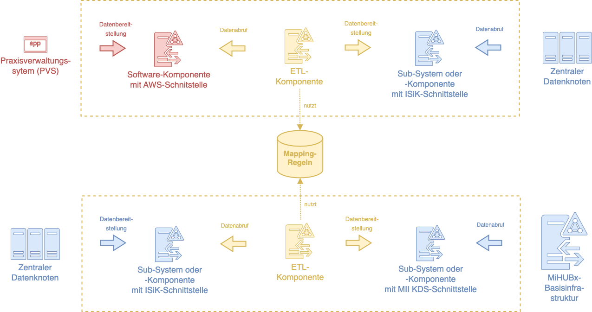

# Technischen Kompatibilität zwischen den AWS-, ISiK- und MII KDS-Patient FHIR Profilen

## Hintergrund

Im Rahmen des Forschungsprojektes und [Digitalen FortschrittsHubs MiHUBx](https://mihubx.de) wurde eine Untersuchung zur Eignung der Telematikinfrastruktur (TI) zur möglichen Anbindung niedergelassener Ärzt:innen an die entwickelte MiHUBx-Basisinfrastruktur durchgeführt. Das übergeordnete Ziel ist die Bereitstellung von Gesundheitsdaten der ambulanten Versorgung zu Forschungszwecken über die Strukturen der Medizininformatik-Initiative, um die Versorgung zu verbessern.

Nach [§§371 bis 374 SGB V](https://www.gesetze-im-internet.de/sgb_5/BJNR024820988.html#BJNR024820988BJNG011200126) sind die Kassenärztliche Bundesvereinigung für den ambulanten Sektor sowie die Gesellschaft für Telematik für den stationären Sektor gleichermaß zur Festlegung einer offenen und standardisierten Schnittstelle für die Archivierung von Patientendaten sowie Übertragung von Patientendaten beim Systemwechsel bzw. die Anbindung versorgungsorientierter informationstechnischer Systeme zur Verarbeitung von Patientendaten angehalten. In §374 SGB V wird darüber hinaus gefordert, dass bei inhaltlichen Gemeinsamkeiten auch sektorübergreifend einheitliche Vorgaben zu treffen sind. Mit dem derzeit als [Kabinettvorlage existierende Gesundheitsdatennutzungsgesetz (GDNG)](https://www.bundesgesundheitsministerium.de/fileadmin/Dateien/3_Downloads/Gesetze_und_Verordnungen/GuV/D/Kabinettvorlage_Gesundheitsdatennutzungsgesetz-GDNG.pdf) wird die Bereitstellung und Nutzung von Gesundheitsdaten zu Forschungszwecken explizit adressiert und implizit auf Ergebnisse der Medizininformatik-Initiative Bezug genommen.

Im Rahmen der Untersuchung bildet der [Gematik ISiK-Schnittstellenstandard](https://fachportal.gematik.de/informationen-fuer/isik) als Anwendung der TI das zentrale Bindeglied zwischen dem ambulanten Sektor, in welchem die Erfassung der Versorgungsdaten stattfindet, sowie der Sekundärnutzung von Versorgungsdaten, die über organisatorische und technische Strukturen des stationären Sektors zu Forschungszwecken nutzbar gemacht werden.

## Abgrenzung

Die Untersuchung fokussiert den [ISiK-Schnittstellenstandard](https://fachportal.gematik.de/informationen-fuer/isik) als TI-Anwendung, da er für das geschilderte Austauschszenario geeignet sein sollte und eine vollumfängliche Untersuchung aller Anwendungen bzw. Komponenten der TI aufgrund von Umfang und Komplexität nicht möglich war. Weiterhin wurde die Untersuchung auf ausgewählte Informationsobjekte der Routineversorgung (Patient, Diagnose, Krankenversicherungsverhältnis) begrenzt und ausschließlich die Kompatibilität auf technischer Ebene betrachtet.

## Ziel

Mit diesem Repository sollen die Probleme bei der technischen Kompatibilität der FHIR Profile zum Informationsobjekt _Patient_ folgender Schnittstellenstandards in der jeweils zum Zeitpunkt der Ergebnisbereitstellung aktuellen stabilen Version untersucht und entsprechende Mapping-Empfehlungen vorgestellt werden:

* [Archiv- und Wechselschnittstelle (AWS), Kassenärztliche Bundesvereinigung, Version v1.2.0](https://simplifier.net/packages/kbv.ita.aws/1.2.0/files/775417)
* [Informationstechnische Systeme in Krankenhäusern (ISiK), Gesellschaft für Telematik, Basismodul Stufe 3, Version v3.0.0](https://simplifier.net/packages/de.gematik.isik-basismodul/3.0.0/files/2047391)
* [Kerndatensatz-Modul Person (MII KDS Person), Medizininformatik-Initiative, Version v1.0.16](https://simplifier.net/packages/de.medizininformatikinitiative.kerndatensatz.person/1.0.16/files/525898)

Die identifizierten Probleme und Ursachen werden benannt und entsprechende Empfehlungen für ein mögliches Mapping gegeben. Für die Empfehlungen werden darüber hinaus konkrete technologieneutrale und FHIR-konforme Mapping-Regel mithilfe der [FHIR Mapping Language](https://hl7.org/fhir/mapping-language.html) erstellt, die sich wiederverwenden, integrieren und erweitern lassen. Nachfolgende Abbildung verdeutlicht ein mögliches Einsatzszenario der Mapping-Regeln.

## Ergebnisse

Nachfolgend werden die identifizierten Probleme, die zugehörigen Ursachen sowie entsprechende Empfehlungen zum Mapping vorgestellt.

### Mapping-Regeln von _AWS v1.2.0_ Patient nach _ISiK Basismodul v3.0.0_ Patient

| Problem | Ursache | Empfehlung |
|---------|---------|------------|
| NamingSystem beim der 10-stelligen KVID verschieden | Unterschiedliche Versionen bei Paketabhängigkeit _Basisprofil DE (R4)_| Substitution des NamingSystem (recommendation-1) |
| Patientenidentifikator vom Typ _HL7 v2 Table 0203, Medical Record_ erforderlich | Unterschiedliche _min_-Kardinalitäten bei Patientenidentifikatoren im Slice _PID_ / _Patientennummer_ | Umwandlung sämtlicher Patientenidentifikatoren als Patientenidentifikator vom geforderten Typ (recommendation-2) |

### Mapping-Regeln von _ISiK Basismodul v3.0.0_ Patient nach _MII KDS Person v1.0.16_ Patient

| Problem | Ursache | Empfehlung |
|---------|---------|------------|
| NamingSystem beim der 10-stelligen KVID verschieden | Unterschiedliche Versionen bei Paketabhängigkeit _Basisprofil DE (R4)_| Substitution des NamingSystem (recommendation-3) |
| Angabe des Ausstellers bzw. Verwalters (zuweisende Organisation) der KVID erforderlich | Unterschiedliche _min_-Kardinalitäten der zuweisenden Organisation beim Patientenidentifikator im Slice _GKV_ | Bei Nicht-Existenz eine zuweisenden Organisation wird eine leere Organisation mit der [Data Absent Reason-Erweiterung](https://hl7.org/fhir/extensions/StructureDefinition-data-absent-reason.html) eingefügt (recommendation-4) |
| Angabe mindestens einer Adresse zum Patienten ist erforderlich | Unterschiedliche _min_-Kardinalitäten bei der Eigenschaft zur Adressangabe | Bei Nicht-Existenz einer Adresse wird eine leere Adresse mit der [Data Absent Reason-Erweiterung](https://hl7.org/fhir/extensions/StructureDefinition-data-absent-reason.html) eingefügt (recommendation-5) |

## Erläuterungen zum Repository

| Inhalt | Beschreibung | Kommentar |
|--------|--------------|-----------|
| `assets` | Verzeichnis für Ressourcen, wie z.B. Grafiken für die README ||
| `compare.sh` | Bash-Skript zur Ausführung der FHIR-Profil-Vergleiche | Benötigte Ressourcen (z.B. FHIR Validator, FHIR StructureDefinitions und -Pakete) werden automatisch heruntergeladen |
| `examples` | Verzeichnis für zu transformierende Beispieldateien eines Patienten | Bei lokaler Ausführung des `run.sh` Skripts wird der Beispielpatient aus dem AWS FHIR-Paket hier gespeichert |
| `map.sh` | Bash-Skript zur Vorbereitung und Ausführung der Transformation des Beispielpatienten aus dem AWS FHIR-Paket unter Verwendung der Mapping-Regeln | Benötigte Ressourcen (z.B. FHIR Validator, FHIR StructureDefinitions und -Pakete) werden automatisch heruntergeladen |
| `maps` | Verzeichnis für Dateien mit Mapping-Regeln gem. FHIR Mapping Language | Die obigen Empfehlungen sind hier als Mapping-Regeln implementiert und unter dem jeweiligen Kürzel referenziert |
| `output` | Verzeichis für Kompilations- und Transformationsergebnisse sowie für die generierten Berichte der FHIR-Profil-Vergleiche | Bei lokaler Ausführung des `run.sh` Skripts werden die erzeugten FHIR StructureMaps und transformierte Beispielpatienten hier gespeichert |
| `sources` | Verzeichnis für die heruntergeladenen FHIR StructureDefinitions, die die FHIR Profile zum Informationsobjekt Patient des jeweiligen Schnittstelenstandards darstellen ||
